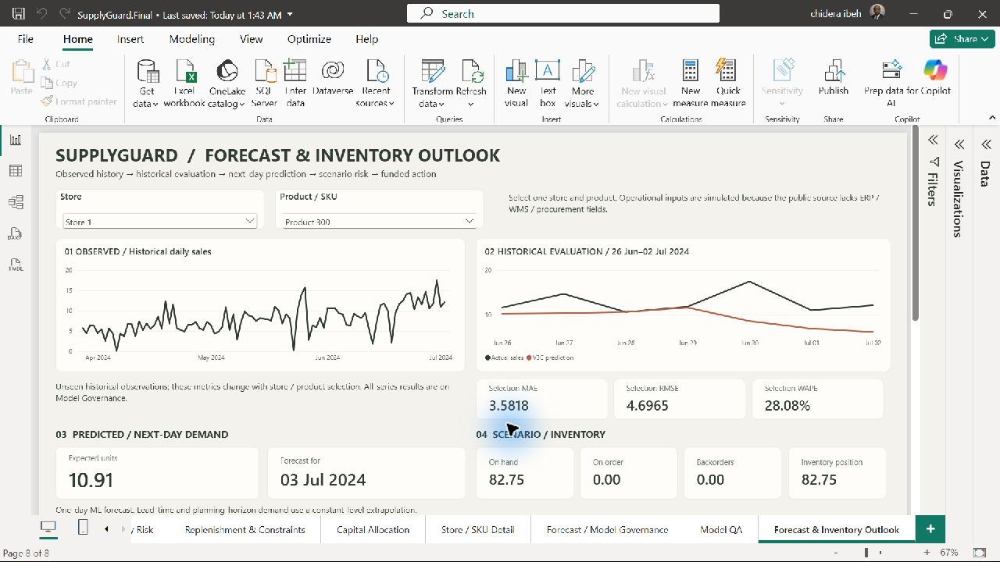
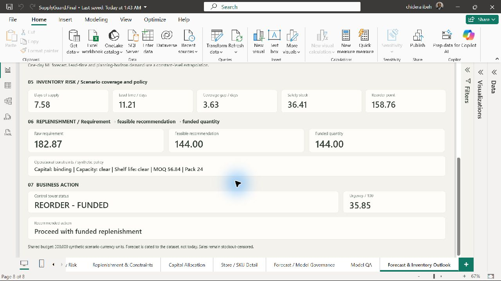

# SupplyGuard

SupplyGuard is a portfolio-scale supply-chain control tower that turns retail demand and stock-availability data into transparent inventory and procurement decisions. It combines a PostgreSQL analytical warehouse, leakage-safe demand forecasting, synthetic operating scenarios, constraint-aware replenishment logic, and a decision-ready control-tower mart.

> **Status:** Phase 10 complete: local batch pipeline, dated forecast-to-action report, reconciliation and portfolio documentation validated; approved Phase 8 pages preserved. The approved report is `app/SupplyGuard.pbix`. See [the Phase 9 operations guide](docs/phase9_operations.md) for commands, persistence, recovery, assumptions and checks.

## The problem

Forecasts alone do not tell a planner what to buy. A useful supply-chain system must also account for inventory already available or on order, demand and lead-time uncertainty, service targets, minimum order quantities, case packs, storage capacity, shelf life, supplier reliability, and limited capital.

SupplyGuard addresses that full decision path:

1. ingest and validate store-SKU demand and availability data;
2. build an auditable dimensional model and leakage-safe features;
3. forecast next-day observed sales;
4. translate demand into reorder points and order requirements;
5. enforce operational constraints and rank competing orders;
6. allocate a shared procurement budget; and
7. publish statuses and recommended actions in a single mart.

## Architecture

```text
FreshRetailNet-50K Parquet files
              |
              v
  raw -> staging -> core -> feature
                               |
                               v
           V3C next-day forecast -> ops.forecast
                               |
                               v
          synthetic scenario inputs
       (inventory, suppliers, economics)
                               |
                               v
 inventory decision -> constrained order -> priority score
                               |
                               v
             shared-capital allocation
                               |
                               v
                   mart.control_tower
                               |
                               v
           Power BI forecast-to-action control tower
```

The main stack is Python 3.14, pandas, PyArrow, scikit-learn, SQLAlchemy/Psycopg, PostgreSQL, and SQL.

## Data pipeline

The real-data backbone is FreshRetailNet-50K: 4.5 million training rows and 350,000 evaluation rows covering 50,000 store-product series, 865 products, 898 stores, and 97 consecutive dates.

- `raw.retail_daily` preserves the source fields, nested hourly arrays, source filename, and ingestion timestamp. Python streams Parquet batches through PostgreSQL `COPY`, records run metadata, and prevents duplicate file loads.
- `staging.retail_daily` casts and constrains the daily grain; `staging.v_retail_hourly` exposes the 24-element sales and stock-status arrays at hourly grain.
- `core.fact_daily_demand` stores the validated store-product-date facts. Product, store, and date dimensions provide reusable descriptive context.
- `feature.daily_demand` and the V2/V3 views generate lagged demand, rolling level/volatility/peak, recent growth, availability history, calendar, commercial, and weather features.
- Automated validation checks row counts, business-key uniqueness, value ranges, and dimension referential integrity. The detailed source dictionary is in [`docs/data_dictionary.md`](docs/data_dictionary.md).

## Exploratory analysis

The Phase 4 SQL and Python analysis covers demand concentration, series intermittency and volatility, temporal patterns, weekday/weekend behaviour, promotions and holidays, discount behaviour, stockout exposure, and weather relationships.

Key findings that shaped the modelling approach:

- approximately 44% of training store-product-days contain at least one out-of-stock hour in the 06:00-22:00 window;
- severe 13-16-hour stockout days have a zero-sales rate of approximately 54.5%;
- short stockouts can coincide with high sales, consistent with demand depleting inventory, while long stockouts suppress observed sales; and
- weather features did not improve the validation model, while commercial features did.

The forecasting target is therefore **observed sales**, not fully unconstrained latent demand. Stockout history is included as context, but the current project does not reconstruct lost sales.

## Forecasting

All learned models use `HistGradientBoostingRegressor` with fixed hyperparameters and non-negative prediction clipping. MAE is the main selection metric; RMSE highlights large misses, and WAPE reports absolute error relative to total observed demand.

### Temporal validation

The split is chronological, never random:

| Purpose | Dates | Role |
|---|---:|---|
| Development training | 2024-04-11 to 2024-06-11 for V1; complete 28-day histories for V2/V3 | Fit candidate models |
| Validation | 2024-06-12 to 2024-06-25 | Compare features and freeze V3C |
| Final holdout | 2024-06-26 to 2024-07-02 | One-time final evaluation |

Every rolling statistic excludes the current row (`... AND 1 PRECEDING`), and the final holdout was not used for feature selection. V2/V3 require exactly 28 prior observations, leaving 2.4 million development-training rows and 700,000 validation rows. The final model is refit on all eligible data through 2024-06-25 before evaluation on 350,000 holdout rows.

### Baselines and model development

The untouched holdout baseline comparison established the seven-day rolling mean as the strongest simple forecast:

| Baseline | MAE | RMSE | WAPE |
|---|---:|---:|---:|
| 7-day rolling mean | **0.4129** | **0.6948** | **34.61%** |
| Same weekday (`lag_7`) | 0.4991 | 0.8358 | 41.83% |
| Previous day (`lag_1`) | 0.5041 | 0.8538 | 42.26% |

Candidate results below are from the development validation window and are directly reproducible from the checked-in scripts:

| Version | Feature design | MAE | RMSE | WAPE |
|---|---|---:|---:|---:|
| Rolling baseline | Prior 7-day mean | 0.3831 | **0.6312** | 33.99% |
| V1 | 14-day history, calendar, categories, stockout history | 0.3652 | 0.6549 | 32.40% |
| V2 | Richer 28-day lags, level, volatility, peaks, and growth | 0.3628 | 0.6425 | 32.19% |
| V3W | V2 + weather | 0.3661 | 0.6479 | 32.48% |
| V3 | V2 + commercial + weather | 0.3578 | 0.6320 | 31.74% |
| **V3C** | **V2 + discount and activity flag** | **0.3564** | **0.6295** | **31.62%** |

V1 improved MAE and WAPE but not RMSE. The ablation study then showed that commercial variables added useful signal, whereas weather slightly degraded performance. V3C was selected and frozen because it achieved the best validation result with fewer features than full V3.

### Final holdout result

| Model | MAE | RMSE | WAPE |
|---|---:|---:|---:|
| 7-day rolling baseline | 0.4129 | 0.6948 | 34.61% |
| **Frozen V3C** | **0.3815** | **0.6933** | **31.98%** |

V3C reduced holdout MAE and WAPE by approximately 7.6% relative to the rolling baseline; RMSE improved by approximately 0.2%. The modest RMSE change indicates that large errors remain difficult even though typical absolute error improved.

## Scenario layer

The source dataset provides real downstream demand and availability but no inventory snapshots, supplier master, purchase orders, lead-time history, costs, capacity, or capital policy. Phase 7 therefore adds a clearly separated `scenario` schema:

| Table | Purpose |
|---|---|
| `scenario.inventory_position` | On hand, on order, backorders, next receipt, unit cost, and capacity |
| `scenario.supplier_policy` | Supplier, lead-time mean/variation, MOQ, case pack, service target, horizon, cost, and on-time rate |
| `scenario.product_priority` | Stockout/holding costs, shelf life, working-capital cap, and business weight |

`generate_inputs.py` selects a reproducible, demand-stratified sample of 1,000 real store-product series and generates those operational attributes with documented rules and random seed 42. These inputs are **synthetic development scenarios**, not observed company operations, and resulting order values or status counts must not be interpreted as real-world business outcomes.

## Decision engine

`mart.inventory_decision` calculates:

- inventory position = on hand + on order - backorders;
- lead-time demand from expected daily demand and average lead time;
- safety stock from both demand variability and lead-time variability at the selected service level;
- reorder point = lead-time demand + safety stock;
- target stock = planning-horizon demand + safety stock; and
- reorder requirement, coverage gap, and raw order quantity.

The next layer rounds requirements to valid case packs and at least the MOQ, then caps quantities by per-item working capital, remaining warehouse capacity, and shelf-life demand. It retains both the unconstrained requirement and unmet quantity so constraints remain visible rather than silently discarding demand.

Orders are prioritised with a transparent 0-100 urgency score:

- coverage gap: 30%;
- stockout cost: 20%;
- demand level: 15%;
- unmet requirement: 15%;
- supplier risk: 10%; and
- business priority: 10%.

The final allocator processes eligible orders in descending urgency, uses whole case packs, enforces MOQ, permits partial funding only when procurement-valid, and tracks spend against a configurable shared budget of 300,000 currency units by default. `sql/031_...` preserves an earlier value-based allocation prototype; `sql/032_...` is the procurement-valid allocation used by the control tower.

### Control-tower mart

`mart.control_tower` joins demand, inventory, supplier, constraint, priority, and funding outputs at store-product-decision-date grain. It assigns an operational status and plain-language next action, including:

- `CRITICAL - ORDER NOW` / `HIGH - ORDER NOW`;
- `CRITICAL - FUNDING ESCALATION`;
- `CONSTRAINED - ESCALATE`;
- `REORDER - FUNDED` / `REORDER - UNFUNDED`;
- `WATCH`; and
- `HEALTHY`.

The current scenario build produces 1,000 control-tower rows ready for a BI semantic model.

## Reproduce the project

For the current all-in-one workflow, use `python -m supplyguard.pipeline` and the [operations guide](docs/phase9_operations.md). The commands below retain the original development sequence; current decision rebuilds require the pipeline.

### Prerequisites

- Python 3.14
- PostgreSQL with `psql` available
- FreshRetailNet-50K `train.parquet` and `eval.parquet` files (not committed)

Create a database and application user, then create the required schemas (`raw`, `staging`, `core`, and `mart`) owned by that user. From the repository root:

```powershell
python -m venv .venv
.\.venv\Scripts\Activate.ps1
python -m pip install -e .
Copy-Item .env.example .env
```

Set the PostgreSQL connection values in `.env`, place the Parquet files under `data/external/`, and initialise the base tables:

```powershell
$baseSql = 1..10 | ForEach-Object { Get-ChildItem ("sql/{0:D3}_*.sql" -f $_) }
$baseSql | ForEach-Object { psql -U supplyguard_app -d supplyguard -v ON_ERROR_STOP=1 -f $_.FullName }

python -c "from pathlib import Path; from supplyguard.ingestion.retail import ingest_parquet; ingest_parquet(Path('data/external/train.parquet'))"
python -c "from pathlib import Path; from supplyguard.ingestion.retail import ingest_parquet; ingest_parquet(Path('data/external/eval.parquet'))"

psql -U supplyguard_app -d supplyguard -v ON_ERROR_STOP=1 -f sql/011_rebuild_derived_layers.sql
python -m supplyguard.validation
pytest
```

Build features and reproduce the model comparisons:

```powershell
18..25 | ForEach-Object {
    Get-ChildItem ("sql/{0:D3}_*.sql" -f $_) |
        ForEach-Object { psql -U supplyguard_app -d supplyguard -v ON_ERROR_STOP=1 -f $_.FullName }
}

python -m supplyguard.models.forecasting_baselines
python -m supplyguard.models.train_baseline_ml
python -m supplyguard.models.train_model_v2
python -m supplyguard.models.train_model_v3
python -m supplyguard.models.run_ablation
python -m supplyguard.models.final_evaluation
```

Build the synthetic operating scenario and decision marts:

```powershell
psql -U supplyguard_app -d supplyguard -v ON_ERROR_STOP=1 -f sql/026_create_scenario_tables.sql
python -m supplyguard.scenario.generate_inputs

27..33 | ForEach-Object {
    Get-ChildItem ("sql/{0:D3}_*.sql" -f $_) |
        ForEach-Object { psql -U supplyguard_app -d supplyguard -v ON_ERROR_STOP=1 -f $_.FullName }
}
```

The EDA queries are `sql/012_...` through `sql/017_...`. Generated figures and prediction CSVs are written under `outputs/` and are intentionally not versioned.

## Project structure

```text
supplyguard/
|-- app/                          # approved Power BI snapshot
|-- config/                       # operational policy settings
|-- scripts/                      # scheduler-friendly wrapper
|-- data/                         # local source data (not versioned)
|-- docs/
|   `-- data_dictionary.md       # source semantics and quality findings
|-- outputs/                      # generated predictions and figures
|-- sql/
|   |-- 001-011                  # warehouse objects, loads, rebuild
|   |-- 012-017                  # exploratory analysis
|   |-- 018-025                  # feature tables/views and temporal splits
|   |-- 026-033                  # scenarios, decisions, constraints, allocation, mart
|   |-- 034-035                  # Power BI views and classification correction
|   `-- 036-037                  # run/model/forecast metadata and store/group bridge
|-- src/supplyguard/
|   |-- analysis/                # Python EDA and figures
|   |-- ingestion/               # Parquet-to-PostgreSQL ingestion
|   |-- models/                  # baselines, V1-V3, ablation, final evaluation
|   |-- scenario/                # reproducible synthetic operational inputs
|   |-- database.py              # database connection
|   |-- pipeline_runs.py         # ingestion run audit trail
|   `-- validation.py            # warehouse data-quality checks
|-- tests/                       # focused unit tests
|-- .env.example
`-- pyproject.toml
```

## Current limitations

- The history is short: 90 training days plus a seven-day holdout. Annual seasonality and long-term drift cannot be estimated.
- Sales are censored during stockouts; the model forecasts observed sales rather than unconstrained demand.
- Supplier, inventory, cost, capacity, shelf-life, and funding inputs are synthetic and cover only 1,000 sampled series.
- The operational decision engine now consumes persisted next-day V3C forecasts with run/model lineage. It treats that next-day level as constant over lead time and the planning horizon; it is not a multi-horizon forecast. Future commercial inputs are explicitly carried forward and holidays are configured.
- Model training is batch-oriented with local versioned artifacts. There is no installed schedule, drift monitoring, probabilistic forecast, or calibrated service-level backtest.
- The 300,000-unit default shared budget and configurable urgency weights are prototype policy parameters, not optimised or externally validated rules.
- Tests include forward-feature cutoffs, configuration, procurement validity and transactional publication. Business service-level calibration remains untested.
- The Power BI dashboard and local batch orchestration are implemented. There is no hosted API, application authentication, cloud deployment or automatic Power BI service refresh.

## Phase 9: operational pipeline

```powershell
.\.venv\Scripts\python.exe -m supplyguard.pipeline --dry-run
.\.venv\Scripts\python.exe -m supplyguard.pipeline
```

The command validates/reuses source files, rebuilds warehouse features, fits or reuses a versioned V3C model, persists next-day forecasts and publishes checked inventory decisions atomically. Existing synthetic scenario inputs are reused by default. Use `config/pipeline.toml` for the budget and policy settings.

Operational artifacts and logs live under `outputs/production/`. Run, stage, model and forecast records live in PostgreSQL's `ops` schema. The approved PBIX is an imported snapshot; refresh after a successful pipeline run. Phase 10 adds stable forecast BI interfaces and an outlook page.

The SQL commands above document the original development sequence. **Use the pipeline for current decision rebuilds:** script 028 now requires a persisted forecast run and cutoff supplied by the pipeline. See [Phase 9 operations](docs/phase9_operations.md) for setup, test commands, recovery, scheduling and limitations.

## Phase 10: forecast-to-action demonstration

The Forecast & Inventory Outlook page connects observed history and held-out accuracy to an explicitly dated next-day forecast, synthetic inventory, risk, constrained replenishment, funded quantity and action. The seven approved pages remain, with factual currency/lineage corrections.

Stable PostgreSQL interfaces serve observed history, historical evaluation and the exact operational forecast used by the published decisions. Historical evaluation is fingerprinted and checked against observed sales; it remains separate from operational model refitting.

- [BI interfaces, refresh and demo](docs/phase10_bi.md)
- [Architecture and inventory semantics](docs/architecture.md)
- [Interview pitch, technical defence and CV bullets](docs/interview_readiness.md)
- [Execution plan](docs/phase10_plan.md)
- [QA results and representative cases](docs/phase10_qa.md)

All 25 tests passed; the complete batch run and Power BI refresh succeeded. See the QA report for run lineage and limitations. No business savings are inferred from scenario results.





## Technical note

SupplyGuard is a decision-support prototype, not an autonomous purchasing system. Its design favours traceability: every recommendation exposes the demand assumption, inventory math, binding constraints, priority score, funding result, status, and action.
