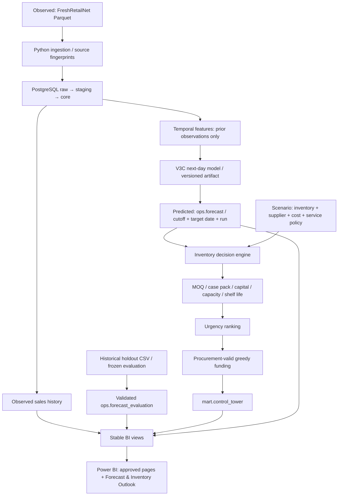

# SupplyGuard — architecture and decision semantics

The schemas express responsibility, not separate services. Raw preserves source evidence; staging applies types; core supplies reusable facts/dimensions; feature owns temporal predictors; ops records runs, artifacts and predictions; scenario isolates synthetic operational assumptions; mart serves decisions and BI.

The historical evaluation fit ends on 25 June 2024. Its seven-day holdout uses one-day predictions with prior observed history available for each target day; it is not a seven-step recursive forecast from one origin. The operational fit may use data through 2 July, then predict 3 July. Those operational predictions cannot be used to re-score the untouched holdout.

## Inventory mathematics

Days of supply uses physical on-hand stock / expected daily demand; inventory position additionally includes on-order stock and backorders.

Inventory position = on hand + on order − backorders. The engine uses max(next-day prediction, 0.01) as expected daily demand. Stored predictions retain zero. Lead-time demand and planning-horizon demand extrapolate this constant level; they are not additional ML forecast horizons.

Safety stock = z * sqrt(mean lead time * demand variance + expected daily demand^2 * lead-time variance). Demand variability comes from observed training-source sales through the cutoff, not forecast residuals. The SQL uses z = 2.326 for service targets >=0.99, 1.960 for targets >=0.975, otherwise 1.645. This is a bucketed policy approximation, not a fitted service-level guarantee. It assumes the variance components can be combined without modelling dependence. Reorder point = expected lead-time demand + safety stock. Target stock = planning-horizon demand + safety stock. Raw requirement = max(target stock − inventory position, 0). The reorder flag is a separate policy condition; a positive raw requirement alone is not permission to order.

Feasible recommendations respect case packs, MOQ and per-item capital, remaining capacity and shelf-life caps. Shared funding processes urgency order, rounds to whole packs and accepts only procurement-valid positive allocations. A binding constraint can therefore reduce an order to zero. The greedy rule is transparent and reproducible but does not establish a globally optimal service or profit outcome.

All currency amounts are synthetic scenario units. No procurement is submitted by this system.
